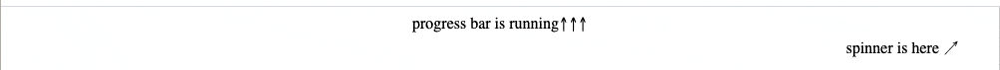
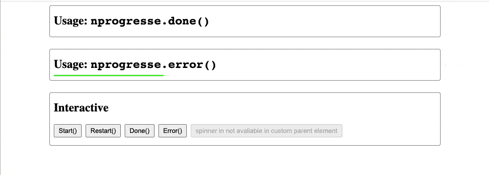

# NProgressE  

> Minimalist progress bar

[](https://www.npmjs.com/package/nprogresse)

See the original [nprogress](https://github.com/rstacruz/nprogress) written by rstacruz, without whom this project wouldn't exist.

The last letter `e` is used for package name distinction, while the usages are almost the same, see the following.

<!-- START doctoc generated TOC please keep comment here to allow auto update -->
<!-- DON'T EDIT THIS SECTION, INSTEAD RE-RUN doctoc TO UPDATE -->

**Table of Contents**

- [Installation](#installation)
- [Examples](#examples)
- [Basic usage](#basic-usage)
- [Ideas](#ideas)
- [Advanced usage](#advanced-usage)
- [Configuration](#configuration)
  - [`minimum`](#minimum)
  - [`template`](#template)
  - [`easing` and `speed`](#easing-and-speed)
  - [`trickle`](#trickle)
  - [`trickleSpeed`](#tricklespeed)
  - [`showSpinner`](#showspinner)
  - [`parent`](#parent)
- [Customization](#customization)

<!-- END doctoc generated TOC please keep comment here to allow auto update -->

## Installation

```bash
$ npm install --save nprogresse
```

## Examples

Here is an [example code](./examples/basic.html) for basic usage.



Here is an [example code](./examples/simple.html) for simple usage.



## Basic usage

```html
<!-- in standalone html -->
<script src="nprogresse/index.js"></script>
<link rel="stylesheet" href="nprogresse/style.css" />
<script>
  window.NProgressE.start();

  // time elapsed
  window.NProgressE.done();
  // or
  window.NProgressE.error();
</script>
```

Simply call `start()`, `done()` and `error()` to control the progress bar.

```js
import NProgressE from 'nprogresse';
import 'nprogresse/style.css';
// start the progress
NProgressE.start();

// finish the progress in good status
NProgressE.done();

// finish the progress in error status
NProgressE.error();
```

```js
$(document).on('ajax:start', function () {
  NProgressE.start();
});
$(document).on('ajax:end', function () {
  if ('ajax:success') {
    NProgressE.done();
  } else {
    NProgressE.error();
  }
});
```

## Ideas

- Add progress to your Ajax calls! Bind it to the jQuery `ajaxStart` and `ajaxStop` events.

  - `done()` for `ajaxSuccesss`.

  - `error()` for `ajaxError`.

- Make a fancy loading bar even without Turbolinks/Pjax! Bind it to `$(document).ready` and `$(window).load`.

## Advanced usage

**Percentages**

To set a progress percentage, call `.set(n)`, where _n_ is a number between `0..1`.

```js
NProgressE.set(0.0); // same as .start()
NProgressE.set(0.4);
NProgressE.set(1.0); // same as .done()
```

**Incrementing**

To increment the progress bar, just use `.inc()`. This increments it with a random amount. This will never get to 100%: use it for
every image load (or similar).

```js
NProgressE.inc();
```

If you want to increment by a specific value, you can pass that as a parameter:

```js
NProgressE.inc(0.2); // This will get the current status value and adds 0.2 until status is 0.994
```

**Force-done**

By passing `true` to `done()`, it will show the progress bar even if it's not being shown. (The default behavior is that `.done()` will not
do anything if `.start()` isn't called)

```js
NProgressE.done(true);
```

**Force-error**

By passing `true` to `error()`, it will show the progress bar even if it's not being shown.

```js
NProgressE.error(true);
```

**Get the status value**

To get the status value, use `.status`.

```js
console.log(NProgressE.status);
```

**Get the progress element**

To get the element, use `.el`;

```js
console.log(NProgressE.el);
```

## Configuration

### `minimum`

Changes the minimum percentage used upon starting, (default: `0.08`).

```js
NProgressE.configure({ minimum: 0.1 });
```

### `template`

You can change the markup using `template`. To keep the progress
bar working, keep an element with `role='bar'` in there. See the [default template](./src/index.ts#L238) for reference.

```js
NProgressE.configure({
  template: "<div class='....'>...</div>",
});
```

### `easing` and `speed`

Adjust animation settings using _easing_ (a CSS easing string) and _speed_ (in ms), (default: `ease` and `200`).

```js
NProgressE.configure({ easing: 'ease', speed: 500 });
```

### `trickle`

Turn off the automatic incrementing behavior by setting this to `false`. (default: `true`)

```js
NProgressE.configure({ trickle: false });
```

### `trickleSpeed`

Adjust how often to trickle/increment, in ms.

```js
NProgressE.configure({ trickleSpeed: 200 });
```

### `showSpinner`

Turn on loading spinner by setting it to true, (default: `false`).

```js
NProgressE.configure({ showSpinner: true });
```

### `parent`

Specify this to change the parent container, (default: `body`).

```js
NProgressE.configure({ parent: '#container' });
```

## Customization

Modify the built [style.css](./style.css) to your liking.

The included CSS file is pretty minimal.

> Tip: you probably only want to find source less file [here](./src/style.less).

In fact, feel free to scrap it and make your own style!
